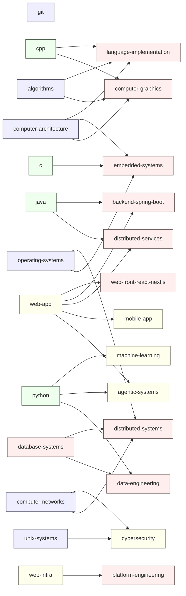
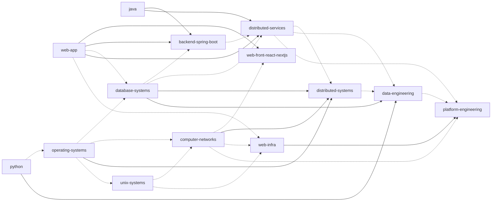
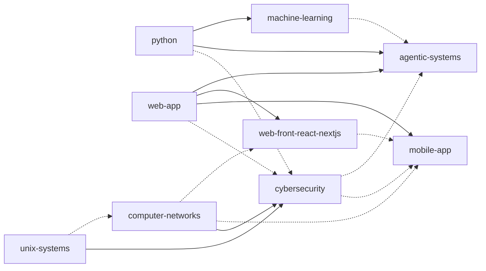
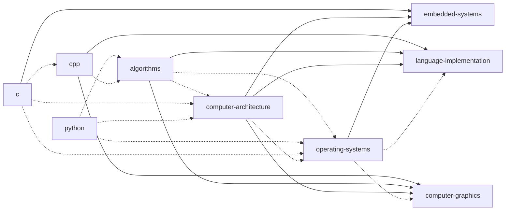

# 브랜치 의존성 지도

> 이 문서는 `catalog/branches.json`에서 생성된다. 직접 수정하지 않는다.

전체 graph의 화살표 `A → B`는 B의 핵심 학습이 A를 직접 전제로 한다는 뜻이다. 권장·연결 관계는 표에서 별도로 확인한다.

## 직접 필수 의존성

| 브랜치 | 직접 필수 의존성 | 권장 기반 |
|---|---|---|
| [`git`](https://github.com/seungwoo7050/guides/tree/git) | 없음 | 없음 |
| [`algorithms`](https://github.com/seungwoo7050/guides/tree/algorithms) | 없음 | [`python`](https://github.com/seungwoo7050/guides/tree/python), [`cpp`](https://github.com/seungwoo7050/guides/tree/cpp) |
| [`c`](https://github.com/seungwoo7050/guides/tree/c) | 없음 | [`git`](https://github.com/seungwoo7050/guides/tree/git) |
| [`cpp`](https://github.com/seungwoo7050/guides/tree/cpp) | 없음 | [`c`](https://github.com/seungwoo7050/guides/tree/c), [`git`](https://github.com/seungwoo7050/guides/tree/git) |
| [`java`](https://github.com/seungwoo7050/guides/tree/java) | 없음 | [`git`](https://github.com/seungwoo7050/guides/tree/git) |
| [`python`](https://github.com/seungwoo7050/guides/tree/python) | 없음 | [`git`](https://github.com/seungwoo7050/guides/tree/git) |
| [`computer-architecture`](https://github.com/seungwoo7050/guides/tree/computer-architecture) | 없음 | [`algorithms`](https://github.com/seungwoo7050/guides/tree/algorithms), [`c`](https://github.com/seungwoo7050/guides/tree/c), [`python`](https://github.com/seungwoo7050/guides/tree/python) |
| [`operating-systems`](https://github.com/seungwoo7050/guides/tree/operating-systems) | 없음 | [`algorithms`](https://github.com/seungwoo7050/guides/tree/algorithms), [`python`](https://github.com/seungwoo7050/guides/tree/python), [`c`](https://github.com/seungwoo7050/guides/tree/c), [`computer-architecture`](https://github.com/seungwoo7050/guides/tree/computer-architecture) |
| [`unix-systems`](https://github.com/seungwoo7050/guides/tree/unix-systems) | 없음 | [`c`](https://github.com/seungwoo7050/guides/tree/c), [`operating-systems`](https://github.com/seungwoo7050/guides/tree/operating-systems) |
| [`computer-networks`](https://github.com/seungwoo7050/guides/tree/computer-networks) | 없음 | [`unix-systems`](https://github.com/seungwoo7050/guides/tree/unix-systems), [`operating-systems`](https://github.com/seungwoo7050/guides/tree/operating-systems) |
| [`web-app`](https://github.com/seungwoo7050/guides/tree/web-app) | 없음 | [`git`](https://github.com/seungwoo7050/guides/tree/git) |
| [`web-front-react-nextjs`](https://github.com/seungwoo7050/guides/tree/web-front-react-nextjs) | [`web-app`](https://github.com/seungwoo7050/guides/tree/web-app) | [`computer-networks`](https://github.com/seungwoo7050/guides/tree/computer-networks) |
| [`backend-spring-boot`](https://github.com/seungwoo7050/guides/tree/backend-spring-boot) | [`java`](https://github.com/seungwoo7050/guides/tree/java), [`web-app`](https://github.com/seungwoo7050/guides/tree/web-app) | [`database-systems`](https://github.com/seungwoo7050/guides/tree/database-systems) |
| [`database-systems`](https://github.com/seungwoo7050/guides/tree/database-systems) | 없음 | [`web-app`](https://github.com/seungwoo7050/guides/tree/web-app), [`algorithms`](https://github.com/seungwoo7050/guides/tree/algorithms), [`operating-systems`](https://github.com/seungwoo7050/guides/tree/operating-systems) |
| [`distributed-services`](https://github.com/seungwoo7050/guides/tree/distributed-services) | [`java`](https://github.com/seungwoo7050/guides/tree/java), [`web-app`](https://github.com/seungwoo7050/guides/tree/web-app) | [`database-systems`](https://github.com/seungwoo7050/guides/tree/database-systems), [`backend-spring-boot`](https://github.com/seungwoo7050/guides/tree/backend-spring-boot) |
| [`web-infra`](https://github.com/seungwoo7050/guides/tree/web-infra) | 없음 | [`unix-systems`](https://github.com/seungwoo7050/guides/tree/unix-systems), [`computer-networks`](https://github.com/seungwoo7050/guides/tree/computer-networks), [`web-app`](https://github.com/seungwoo7050/guides/tree/web-app) |
| [`cybersecurity`](https://github.com/seungwoo7050/guides/tree/cybersecurity) | [`unix-systems`](https://github.com/seungwoo7050/guides/tree/unix-systems), [`computer-networks`](https://github.com/seungwoo7050/guides/tree/computer-networks) | [`web-app`](https://github.com/seungwoo7050/guides/tree/web-app), [`operating-systems`](https://github.com/seungwoo7050/guides/tree/operating-systems), [`web-infra`](https://github.com/seungwoo7050/guides/tree/web-infra), [`python`](https://github.com/seungwoo7050/guides/tree/python), [`c`](https://github.com/seungwoo7050/guides/tree/c), [`computer-architecture`](https://github.com/seungwoo7050/guides/tree/computer-architecture) |
| [`mobile-app`](https://github.com/seungwoo7050/guides/tree/mobile-app) | [`web-app`](https://github.com/seungwoo7050/guides/tree/web-app) | [`web-front-react-nextjs`](https://github.com/seungwoo7050/guides/tree/web-front-react-nextjs), [`computer-networks`](https://github.com/seungwoo7050/guides/tree/computer-networks), [`cybersecurity`](https://github.com/seungwoo7050/guides/tree/cybersecurity) |
| [`machine-learning`](https://github.com/seungwoo7050/guides/tree/machine-learning) | [`python`](https://github.com/seungwoo7050/guides/tree/python) | [`algorithms`](https://github.com/seungwoo7050/guides/tree/algorithms) |
| [`agentic-systems`](https://github.com/seungwoo7050/guides/tree/agentic-systems) | [`python`](https://github.com/seungwoo7050/guides/tree/python), [`web-app`](https://github.com/seungwoo7050/guides/tree/web-app) | [`distributed-services`](https://github.com/seungwoo7050/guides/tree/distributed-services), [`cybersecurity`](https://github.com/seungwoo7050/guides/tree/cybersecurity), [`machine-learning`](https://github.com/seungwoo7050/guides/tree/machine-learning) |
| [`distributed-systems`](https://github.com/seungwoo7050/guides/tree/distributed-systems) | [`operating-systems`](https://github.com/seungwoo7050/guides/tree/operating-systems), [`computer-networks`](https://github.com/seungwoo7050/guides/tree/computer-networks), [`database-systems`](https://github.com/seungwoo7050/guides/tree/database-systems) | [`algorithms`](https://github.com/seungwoo7050/guides/tree/algorithms), [`distributed-services`](https://github.com/seungwoo7050/guides/tree/distributed-services) |
| [`data-engineering`](https://github.com/seungwoo7050/guides/tree/data-engineering) | [`python`](https://github.com/seungwoo7050/guides/tree/python), [`database-systems`](https://github.com/seungwoo7050/guides/tree/database-systems) | [`distributed-services`](https://github.com/seungwoo7050/guides/tree/distributed-services), [`distributed-systems`](https://github.com/seungwoo7050/guides/tree/distributed-systems) |
| [`platform-engineering`](https://github.com/seungwoo7050/guides/tree/platform-engineering) | [`web-infra`](https://github.com/seungwoo7050/guides/tree/web-infra) | [`distributed-services`](https://github.com/seungwoo7050/guides/tree/distributed-services), [`cybersecurity`](https://github.com/seungwoo7050/guides/tree/cybersecurity), [`computer-networks`](https://github.com/seungwoo7050/guides/tree/computer-networks), [`data-engineering`](https://github.com/seungwoo7050/guides/tree/data-engineering) |
| [`language-implementation`](https://github.com/seungwoo7050/guides/tree/language-implementation) | [`cpp`](https://github.com/seungwoo7050/guides/tree/cpp), [`algorithms`](https://github.com/seungwoo7050/guides/tree/algorithms), [`computer-architecture`](https://github.com/seungwoo7050/guides/tree/computer-architecture) | [`operating-systems`](https://github.com/seungwoo7050/guides/tree/operating-systems) |
| [`embedded-systems`](https://github.com/seungwoo7050/guides/tree/embedded-systems) | [`c`](https://github.com/seungwoo7050/guides/tree/c), [`computer-architecture`](https://github.com/seungwoo7050/guides/tree/computer-architecture), [`operating-systems`](https://github.com/seungwoo7050/guides/tree/operating-systems) | [`cybersecurity`](https://github.com/seungwoo7050/guides/tree/cybersecurity) |
| [`computer-graphics`](https://github.com/seungwoo7050/guides/tree/computer-graphics) | [`cpp`](https://github.com/seungwoo7050/guides/tree/cpp), [`algorithms`](https://github.com/seungwoo7050/guides/tree/algorithms), [`computer-architecture`](https://github.com/seungwoo7050/guides/tree/computer-architecture) | [`operating-systems`](https://github.com/seungwoo7050/guides/tree/operating-systems) |

## 전체 graph

## 분야별 흐름

아래 graph는 카탈로그의 관계에서 생성된다. 실선 `A --> B`는 `requires`, 점선 `A -.-> B`는 `recommends`다. `connects`와 `continues_to`는 순서를 뜻하지 않으므로 표시하지 않는다.

### 웹·데이터·분산·플랫폼

### AI·모바일·보안

### 시스템·도구·그래픽스·임베디드

## 해석 규칙

- 필수 의존성은 브랜치 전체를 무조건 다시 공부하라는 뜻이 아니다. roadmap과 종료 검사를 이용해 이미 가진 능력을 확인한다.
- 권장 관계는 프로젝트 성격에 따라 순서가 달라질 수 있다.
- 업무 트랙의 핵심 목록은 직접 의존성을 생략할 수 있으므로 `docs/03-career-tracks.md`의 “공통·핵심 브랜치와 직접 의존성 순서”를 함께 본다.
- graph에 없더라도 `connects` 관계는 실제 협업에서 중요하다. 상세 내용은 `docs/01-branch-catalog.md`를 본다.
